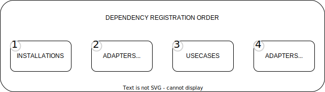

# Golang Dependency Injection Framework🔥

## 🔧 Installation
To install ioc, use the following command:

    go get github.com/Ignaciojeria/einar-ioc@v1.3.0

## 🔍 Before start

The dependencies in the framework are loaded in a specific sequence, as follows:
1. Installations
2. Outbound Adapters
3. Use Cases
4. Inbound Adapters

This sequence ensures that each component is loaded in the correct order for optimal functionality. The diagram below illustrates this dependency loading process:

<p align="center">
  
</p>

## 👨‍💻 Setup

As a first step, we'll make sure that the `main` function loads all the dependencies we will inject later on. This initial loading of dependencies is crucial for setting up our Dependency Injection framework.

```go
package main

import (
	"os"
	ioc "github.com/Ignaciojeria/einar-ioc"
)
func main() {
	if err := ioc.LoadDependencies(); err != nil {
		os.Exit(0)
	}
}
```

## 👨‍💻 Injecting your first Installation

Installations are key instances in the framework, used for a variety of infrastructure operations. These tasks include providing route instances for registering HTTP requests, initializing connections for database operations, setting up brokers for event publication and reception, among others. Effectively, installations lay the groundwork for the essential services that your application relies on, ensuring their seamless integration and operation as foundational elements.

####  🔍 Create your first Installation File
Navigate to the /server folder. Inside this folder, we will create mux.go.
```bash
/server
 - mux.go #Chi Router interface Implementation 
```

####  🔍 Instalation File Implementation
We will be using the Chi Framework (https://github.com/go-chi/chi) and injecting the Chi router using IOC.
```bash
package chi_router

import (
	ioc "github.com/Ignaciojeria/einar-ioc"
	"github.com/go-chi/chi/middleware"
	"github.com/go-chi/chi/v5"
)

var Mux = ioc.InjectInstallation[*chi.Mux](func() (*chi.Mux, error) {
	r := chi.NewRouter()
	// A good base middleware stack
	r.Use(middleware.RequestID)
	r.Use(middleware.RealIP)
	r.Use(middleware.Logger)
	r.Use(middleware.Recoverer)
	return r, nil
})

```

####  🔍 Starting the Server with an Installation
```bash
package main

import (
	"example/server"
	"fmt"
	"net/http"
	"os"

	ioc "github.com/Ignaciojeria/einar-ioc"
)

func main() {
	if err := ioc.LoadDependencies(); err != nil {
		os.Exit(0)
	}
	fmt.Println("server starting at port 8080")
	http.ListenAndServe(":8080", server.Mux.Dependency)
}
```