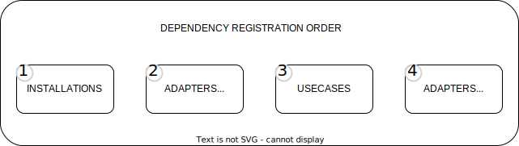

# Golang Dependency Injection Framework🔥

## 🔧 Installation
To install ioc, use the following command:

    go get github.com/Ignaciojeria/einar-ioc@v1.3.0

## :computer: Usage

<p align="center">
  
</p>

```go
package main

import (
	"os"
	ioc "github.com/Ignaciojeria/einar-ioc"
)
func main() {
	if err := ioc.LoadDependencies(); err != nil {
		os.Exit(0)
	}
}
